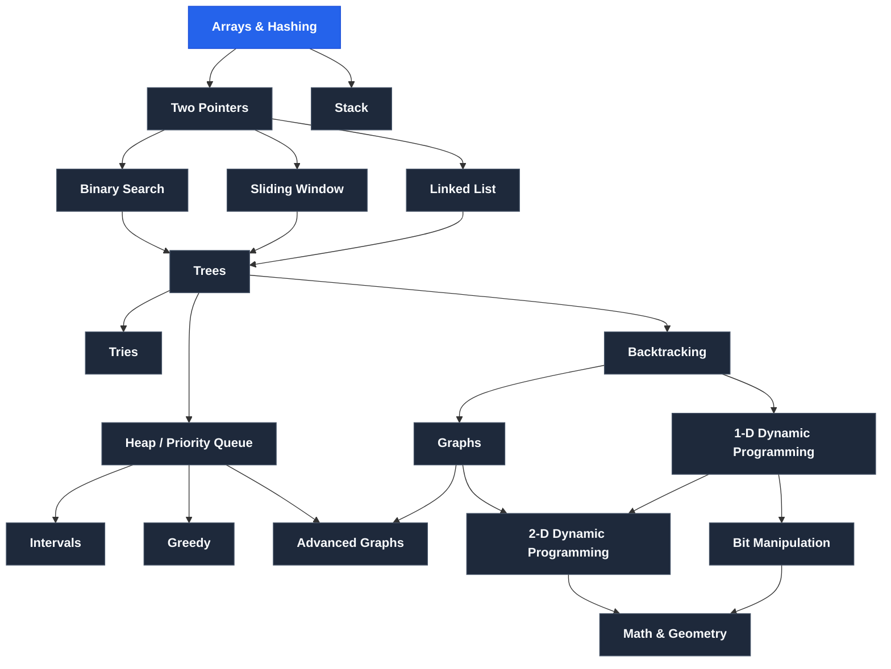

# NeetCode 150 Tree Roadmap & Prerequisites

## 🌳 Cấu trúc cây phụ thuộc (Tree Graph Topology)

---

## 📋 Chi tiết các chủ đề & Kiến thức tiên quyết (Prerequisites)

### 1. Arrays & Hashing

- **Prerequisites (Kiến thức kiến tạo)**:
  - `Dynamic Arrays` _(DSA for Beginners)_
  - `Hash Usage` _(DSA for Beginners)_
  - `Hash Implementation` _(DSA for Beginners)_
  - `Prefix Sums` _(Advanced Algorithms)_
- **Bài tập**:
  - [] Contains Duplicate
  - [] Valid Anagram
  - [x] Two Sum ([`l/twoSum.java`](file:///projects/java150/l/twoSum.java))
  - [ ] Group Anagrams ([`src/Arrays___Hashing/GroupAnagrams.java`](file:///projects/java150/src/Arrays___Hashing/GroupAnagrams.java))
  - [ ] Top K Frequent Elements
  - [ ] Product of Array Except Self
  - [ ] Valid Sudoku
  - [ ] Encode and Decode Strings
  - [ ] Longest Consecutive Sequence

---

### 2. Two Pointers

- **Phụ thuộc từ**: `Arrays & Hashing`
- **Prerequisites**:
  - `Two Pointers` _(DSA for Beginners)_
- **Bài tập**:
  - [ ] Valid Palindrome
  - [ ] Two Sum II Input Array Is Sorted
  - [ ] 3Sum
  - [ ] Container With Most Water
  - [ ] Trapping Rain Water

---

### 3. Stack

- **Phụ thuộc từ**: `Arrays & Hashing`
- **Prerequisites**:
  - `Stacks` _(DSA for Beginners)_
- **Bài tập**:
  - [ ] Valid Parentheses
  - [ ] Min Stack
  - [ ] Evaluate Reverse Polish Notation
  - [ ] Generate Parentheses
  - [ ] Daily Temperatures
  - [ ] Car Fleet
  - [ ] Largest Rectangle In Histogram

---

### 4. Binary Search

- **Phụ thuộc từ**: `Two Pointers`
- **Prerequisites**:
  - `Search Array` _(DSA for Beginners)_
  - `Search Range` _(DSA for Beginners)_
- **Bài tập**:
  - [ ] Binary Search
  - [ ] Search a 2D Matrix
  - [ ] Koko Eating Bananas
  - [ ] Find Minimum In Rotated Sorted Array
  - [ ] Search In Rotated Sorted Array
  - [ ] Time Based Key-Value Store
  - [ ] Median of Two Sorted Arrays

---

### 5. Sliding Window

- **Phụ thuộc từ**: `Two Pointers`
- **Prerequisites**:
  - `Sliding Window Fixed Size` _(DSA for Beginners)_
  - `Sliding Window Variable Size` _(DSA for Beginners)_
- **Bài tập**:
  - [ ] Best Time to Buy And Sell Stock
  - [ ] Longest Substring Without Repeating Characters
  - [ ] Longest Repeating Character Replacement
  - [ ] Permutation In String
  - [ ] Minimum Window Substring
  - [ ] Sliding Window Maximum

---

### 6. Linked List

- **Phụ thuộc từ**: `Two Pointers`
- **Prerequisites**:
  - `Singly Linked Lists` _(DSA for Beginners)_
  - `Doubly Linked Lists` _(DSA for Beginners)_
  - `Fast And Slow Pointers` _(DSA for Beginners)_
- **Bài tập**:
  - [ ] Reverse Linked List
  - [ ] Merge Two Sorted Lists
  - [ ] Reorder List
  - [ ] Remove Nth Node From End of List
  - [ ] Copy List With Random Pointer
  - [ ] Add Two Numbers
  - [ ] Linked List Cycle
  - [ ] Find The Duplicate Number
  - [ ] LRU Cache
  - [ ] Merge K Sorted Lists
  - [ ] Reverse Nodes In K Group

---

### 7. Trees

- **Phụ thuộc từ**: `Binary Search`, `Sliding Window`, `Linked List`
- **Prerequisites**:
  - `Binary Trees` _(DSA for Beginners)_
  - `Binary Search Trees` _(DSA for Beginners)_
  - `BST Insert And Remove` _(DSA for Beginners)_
  - `Depth-First Search (DFS)` _(DSA for Beginners)_
  - `Breadth-First Search (BFS)` _(DSA for Beginners)_
- **Bài tập**:
  - [ ] Invert Binary Tree
  - [ ] Maximum Depth of Binary Tree
  - [ ] Diameter of Binary Tree
  - [ ] Balanced Binary Tree
  - [ ] Same Tree
  - [ ] Subtree of Another Tree
  - [ ] Lowest Common Ancestor of a Binary Search Tree
  - [ ] Binary Tree Level Order Traversal
  - [ ] Binary Tree Right Side View
  - [ ] Count Good Nodes In Binary Tree
  - [ ] Validate Binary Search Tree
  - [ ] Kth Smallest Element In a BST
  - [ ] Construct Binary Tree From Preorder And Inorder Traversal
  - [ ] Binary Tree Maximum Path Sum
  - [ ] Serialize And Deserialize Binary Tree

---

### 8. Tries

- **Phụ thuộc từ**: `Trees`
- **Prerequisites**:
  - `Trie Implementation` _(Advanced Algorithms)_
- **Bài tập**:
  - [ ] Implement Trie Prefix Tree
  - [ ] Design Add And Search Words Data Structure
  - [ ] Word Search II

---

### 9. Heap / Priority Queue

- **Phụ thuộc từ**: `Trees`
- **Prerequisites**:
  - `Heap Properties` _(DSA for Beginners)_
  - `Push and Pop` _(DSA for Beginners)_
  - `Heapify / Build Heap` _(DSA for Beginners)_
- **Bài tập**:
  - [ ] Kth Largest Element In a Stream
  - [ ] Last Stone Weight
  - [ ] K Closest Points to Origin
  - [ ] Kth Largest Element In An Array
  - [ ] Task Scheduler
  - [ ] Design Twitter
  - [ ] Find Median From Data Stream

---

### 10. Backtracking

- **Phụ thuộc từ**: `Trees`
- **Prerequisites**:
  - `Tree Maze (DFS)` _(DSA for Beginners)_
  - `Subsets / Combinations` _(Advanced Algorithms)_
  - `Permutations` _(Advanced Algorithms)_
- **Bài tập**:
  - [ ] Subsets
  - [ ] Combination Sum
  - [ ] Permutations
  - [ ] Subsets II
  - [ ] Combination Sum II
  - [ ] Word Search
  - [ ] Palette Partitioning
  - [ ] Letter Combinations of a Phone Number
  - [ ] N Queens

---

### 11. Graphs

- **Phụ thuộc từ**: `Backtracking`
- **Prerequisites**:
  - `Matrix DFS & BFS` _(DSA for Beginners)_
  - `Adjacency List` _(DSA for Beginners)_
  - `Graph DFS & BFS` _(DSA for Beginners)_
- **Bài tập**:
  - [ ] Number of Islands
  - [ ] Max Area of Island
  - [ ] Clone Graph
  - [ ] Walls And Gates
  - [ ] Rotting Oranges
  - [ ] Pacific Atlantic Water Flow
  - [ ] Surrounded Regions
  - [ ] Course Schedule
  - [ ] Course Schedule II
  - [ ] Graph Valid Tree
  - [ ] Number of Connected Components In An Undirected Graph
  - [ ] Redundant Connection
  - [ ] Word Ladder

---

### 12. 1-D Dynamic Programming

- **Phụ thuộc từ**: `Backtracking`
- **Prerequisites**:
  - `1D DP (Memoization & Tabulation)` _(Advanced Algorithms)_
- **Bài tập**:
  - [ ] Climbing Stairs
  - [ ] Min Cost Climbing Stairs
  - [ ] House Robber
  - [ ] House Robber II
  - [ ] Longest Palindromic Substring
  - [ ] Palindromic Substrings
  - [ ] Decode Ways
  - [ ] Coin Change
  - [ ] Maximum Product Subarray
  - [ ] Word Break
  - [ ] Longest Increasing Subsequence
  - [ ] Partition Equal Subset Sum

---

### 13. Intervals

- **Phụ thuộc từ**: `Heap / Priority Queue`
- **Prerequisites**:
  - `Interval Sorting` _(Advanced Algorithms)_
- **Bài tập**:
  - [ ] Insert Interval
  - [ ] Merge Intervals
  - [ ] Non Overlapping Intervals
  - [ ] Meeting Rooms
  - [ ] Meeting Rooms II
  - [ ] Minimum Interval to Include Each Query

---

### 14. Greedy

- **Phụ thuộc từ**: `Heap / Priority Queue`
- **Prerequisites**:
  - `Greedy Choice Property` _(Advanced Algorithms)_
- **Bài tập**:
  - [ ] Maximum Subarray
  - [ ] Jump Game
  - [ ] Jump Game II
  - [ ] Gas Station
  - [ ] Hand of Straights
  - [ ] Merge Triplets to Form Target Triplet
  - [ ] Partition Labels
  - [ ] Valid Parenthesis String

---

### 15. Advanced Graphs

- **Phụ thuộc từ**: `Heap / Priority Queue`, `Graphs`
- **Prerequisites**:
  - `Dijkstra's Algorithm` _(Advanced Algorithms)_
  - `Prim's / Kruskal's (MST)` _(Advanced Algorithms)_
  - `Topological Sort` _(Advanced Algorithms)_
  - `Union-Find / Disjoint Set` _(Advanced Algorithms)_
- **Bài tập**:
  - [ ] Reconstruct Itinerary
  - [ ] Min Cost to Connect All Points
  - [ ] Network Delay Time
  - [ ] Swim In Rising Water
  - [ ] Alien Dictionary
  - [ ] Cheapest Flights Within K Stops

---

### 16. 2-D Dynamic Programming

- **Phụ thuộc từ**: `Graphs`, `1-D Dynamic Programming`
- **Prerequisites**:
  - `2D DP Grid & Subsequences` _(Advanced Algorithms)_
  - `0/1 Knapsack` _(Advanced Algorithms)_
- **Bài tập**:
  - [ ] Unique Paths
  - [ ] Longest Common Subsequence
  - [ ] Best Time to Buy And Sell Stock With Cooldown
  - [ ] Coin Change II
  - [ ] Target Sum
  - [ ] Interleaving String
  - [ ] Longest Increasing Path In a Matrix
  - [ ] Distinct Subsequences
  - [ ] Edit Distance
  - [ ] Burst Balloons
  - [ ] Regular Expression Matching

---

### 17. Bit Manipulation

- **Phụ thuộc từ**: `1-D Dynamic Programming`
- **Prerequisites**:
  - `Bitwise Operators (AND, OR, XOR, Shifts)` _(DSA for Beginners)_
- **Bài tập**:
  - [ ] Single Number
  - [ ] Number of 1 Bits
  - [ ] Counting Bits
  - [ ] Reverse Bits
  - [ ] Missing Number
  - [ ] Sum of Two Integers
  - [ ] Reverse Integer

---

### 18. Math & Geometry

- **Phụ thuộc từ**: `2-D Dynamic Programming`, `Bit Manipulation`
- **Prerequisites**:
  - `Basic Number Theory & Matrix Operations` _(Advanced Algorithms)_
- **Bài tập**:
  - [ ] Rotate Image
  - [ ] Spiral Matrix
  - [ ] Set Matrix Zeroes
  - [ ] Happy Number
  - [ ] Pow(x, n)
  - [ ] Multiply Strings
  - [ ] Detect Squares
